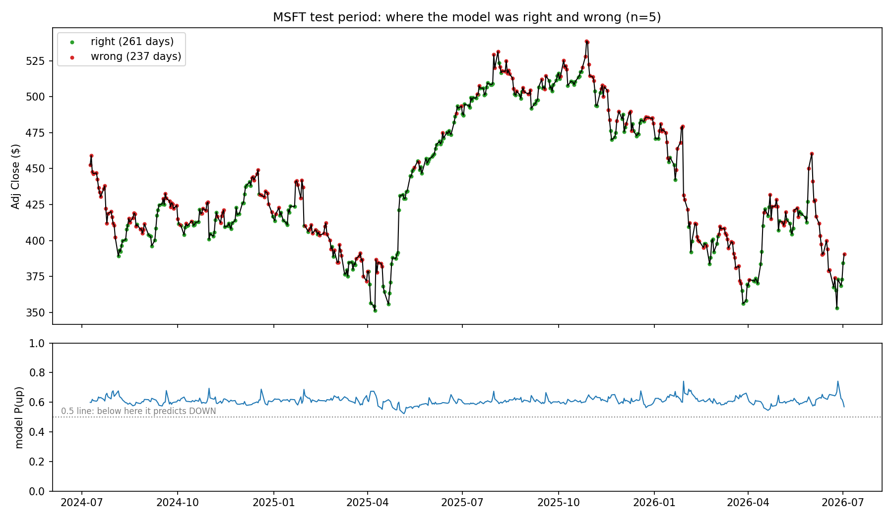
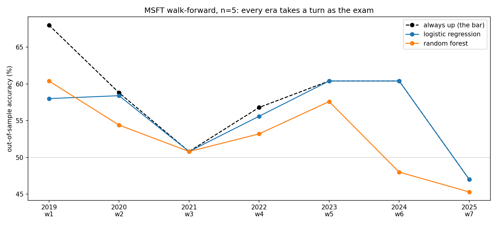

# Findings in full

What actually happened when the models met the market. Back to the [main page](../README.md), or read [how the pipeline works](pipeline.md) first.

## Logistic Regression: results at N = 5

```
Logistic regression   52.4%
Always up             52.4%
Persistence           49.4%
```

* the model TIES the naive baseline exactly. Its learned weights are all near zero: it found no usable signal in the four clues and basically rediscovered the always up strategy
* reported as the honest finding, not tuned away. Four standard technical indicators carry no detectable edge over market drift at the 5 day horizon
* train accuracy was 60.4% vs 52.4% on test, which looks like overfitting until you notice always_up itself drops the same 8 points between eras
    * Basically, the test years were just a flatter market. The gap is a harder regime, not memorization.

## Random Forest: results at N = 5

```
Random forest         47.6%
Always up             52.4%
Persistence           49.4%
```

* train accuracy was 100.0%. It answered all 1,986 training days perfectly, then scored 47.6% on test: below always up, below persistence, below a coin flip
    * Basically, the 52.4 point gap IS overfitting. Put it next to logistic regression's 8 point gap (which was just the flatter market) and you can see what memorization looks like vs a regime shift
* unlike logistic regression, the forest was NOT a rubber stamp: it said up on 360 days and down on 138, with probabilities swinging from 0.21 to 0.96. Real decisions, confidently wrong
    * This is because the "patterns" it memorized were noise in the training years, and acting on fiction is worse than not acting at all. That's how you lose to a strategy that does literally nothing
* feature importances came out nearly even (0.24 to 0.27 across all four clues): it leaned on everything equally, to memorize noise
* takeaway: the humble model learned nothing and tied the baseline. The flexible model "learned" everything and did worse. Neither found signal, because there is no signal in these four clues to find

## diagnose.py, aka the autopsy

* given four standard technical clues, logistic regression concluded none of them beat "MSFT usually drifts up," and became the always up baseline with extra steps
    * Basically, the model always predicted up. ALWAYS, 100% of the time (498 out of 498 test days). This is because its up probability never crossed below 0.5
    * This is because the probability starts near 60% thanks to the training set (60% of training days were up), and the near zero weights never push it far from there. It lived between 0.52 and 0.74 for two straight years
* the four piles (confusion matrix): 261 right (the up days), 237 wrong (the down days), 0 and 0 in the "said down" piles, because it never said down once
* so its errors are exactly the market's down weeks, concentrated in every decline on the chart
    * the chart shows it best: the red (wrong) dots paint every drop, because the model kept saying up while the price fell



## backtest.py, aka walk forward validation

* the problem it solves: every conclusion above rested on ONE exam. One test window = one era, and ours happened to be a flat market
    * Basically, with a single test set you can't tell "this is how it is" apart from "this is how it was that one time"
* so it reruns the SAME experiment seven times, marching through the decade: train a FRESH model on everything before the cutoff, skip the gap, take one exam on the next year of days it has never seen, grade it, throw the model away, slide forward
    * Basically, seven different students, seven exams written after their study materials were printed. No model ever sees its own test year, so there is nothing to memorize
    * yesterday's exam becomes tomorrow's study material (past to future only), which is exactly how real deployment works
* results: logistic regression went 0 wins, 4 ties, 3 losses against always up. Random forest went 0 wins, 1 tie, 6 losses. That's 0 for 14
    * the ties are the rubber stamp on tour: in four eras it said up every day and matched the baseline to the decimal
    * the losses are when it dared to say down and paid for it. In the 2019 window it threw away 10 points second guessing a bull market
* the biggest lesson in the whole project: the bar itself swings from 47% to 68% depending on the era
    * Basically, an accuracy number means NOTHING on its own. 58% was simultaneously the model's best score and its worst defeat, because always up scored 68% on those exact same days
    * judge every accuracy claim against the baseline measured on the same rows, always
* bottom line: the no signal finding holds in every regime of the decade. Bull market, covid crash, bear year, recovery: the models never beat doing nothing


